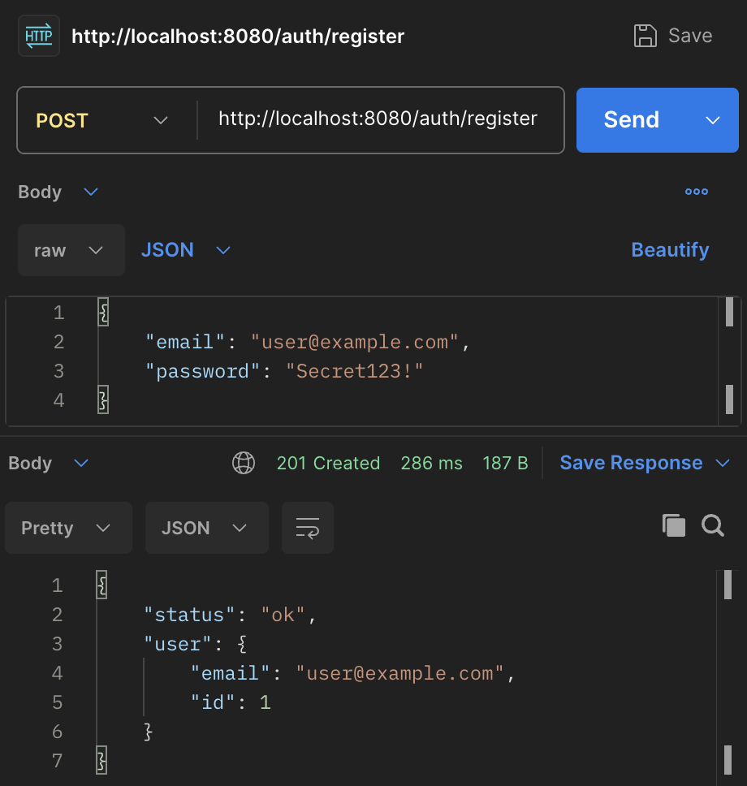
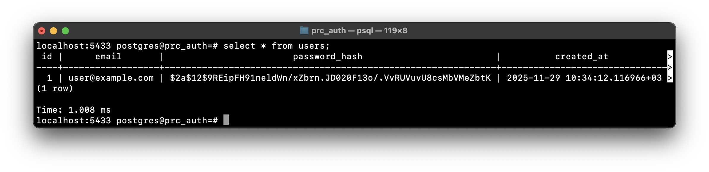
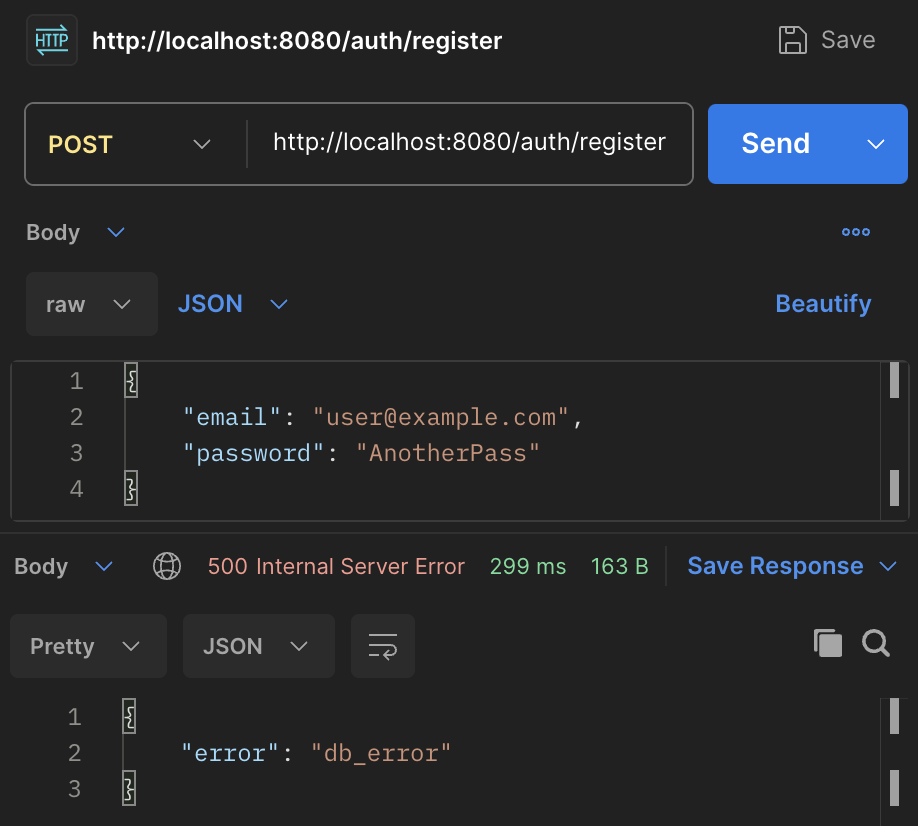
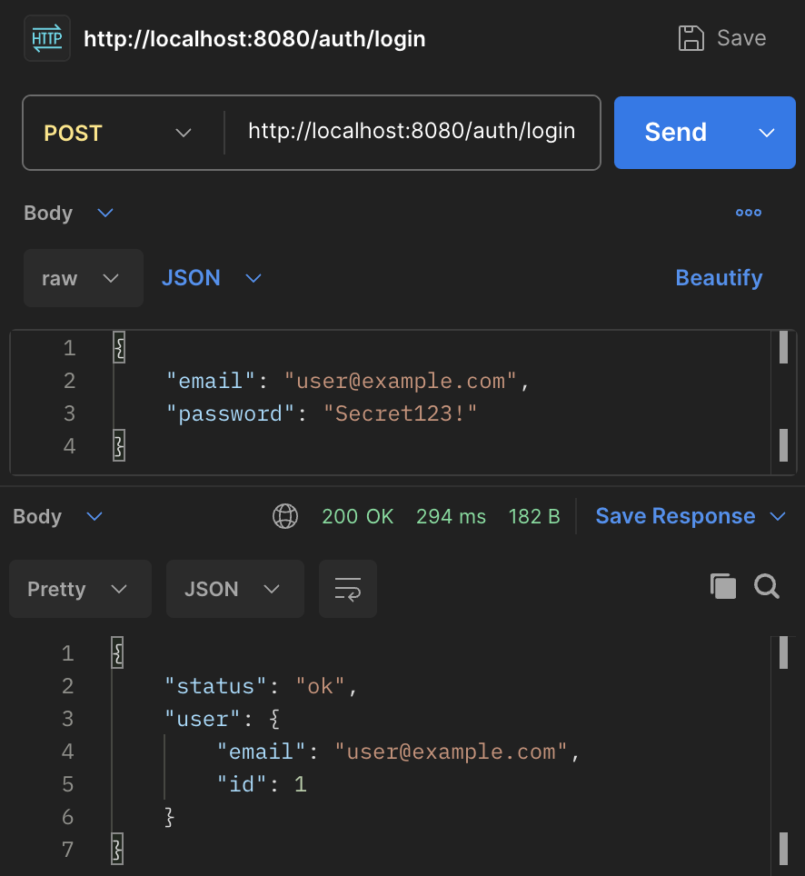
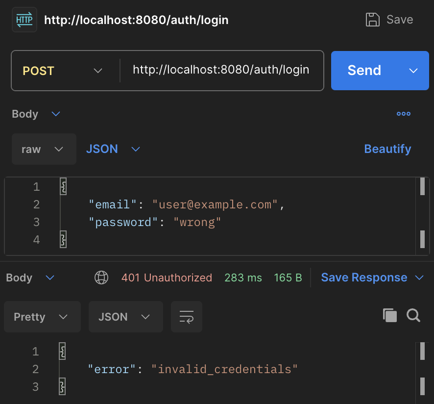

# Коляда Даниил
## Практическая работа №9

### Краткое описание

Минимальный сервис регистрации и авторизации с двумя эндпоинтами:

`POST /auth/register` – регистрация пользователя (email + password), хэширование пароля через bcrypt, запись в БД

`POST /auth/login` – проверка пары email+password и возврат «ok»

---

### Результаты

```
curl -i -X POST localhost:8080/auth/register \
    -H "Content-Type: application/json" \
    -d "{
            "email": "user@example.com",
            "password": "Secret123!"
        }"
```
<p align="center">
  
  
</p>

```
curl -i -X POST localhost:8080/auth/register \
    -H "Content-Type: application/json" \
    -d "{
            "email": "user@example.com",
            "password": "AnotherPass"
        }"
```
<p align="center">
  
</p>

```
curl -i -X POST localhost:8080/auth/login \
    -H "Content-Type: application/json" \
    -d "{
            "email": "user@example.com",
            "password": "Secret123!"
        }"
```
<p align="center">
  
</p>

```
curl -i -X POST localhost:8080/auth/login \
    -H "Content-Type: application/json" \
    -d "{
            "email": "user@example.com",
            "password": "wrong"
        }"
```
<p align="center">
  
</p>

---

### Фрагменты кода

Генерация хэша пароля в обработчике [`Register`](./internal/http/handlers/auth.go#L29-L62)
```go
hash, err := bcrypt.GenerateFromPassword([]byte(in.Password), h.BcryptCost)
if err != nil {
    writeErr(w, http.StatusInternalServerError, "hash_failed")
    return
}
```

Проверка хэша пароля в обработчике [`Login`](./internal/http/handlers/auth.go#L69-L98)
```go
if bcrypt.CompareHashAndPassword([]byte(u.PasswordHash), []byte(in.Password)) != nil {
    writeErr(w, http.StatusUnauthorized, "invalid_credentials")
    return
}
```

Наличие AutoMigrate
```go
func (r *UserRepo) AutoMigrate() error {
	return r.db.AutoMigrate(&core.User{})
}
```

---

### Настройка переменных окружения

Переименуйте файл `.env.example` в `.env`\
Задайте корректный `DB_DSN`, `BCRYPT_COST` и `APP_ADDR`

---

### Краткие выводы

Пароли нельзя хранить в базе данных в открытом виде\
Причины:
1.	Утечка БД = полный доступ злоумышленника ко всем аккаунтам
2.	Пользователи часто используют один и тот же пароль на разных сервисах → последствия утечки распространяются на другие системы
3.	Нарушение базовой безопасности: любая проверка или аудит сразу покажет уязвимость

Используем bcrypt, так как:
1.	Простая реализация (есть в стандартной библиотеке Go через пакет golang.org/x/crypto/bcrypt)
2.	Встроенная соль
3.	Регулируемая сложность через параметр cost

---

### Дерево проекта
```
prc_auth
├── .env.example
├── README.md
├── cmd
│   └── api
│       └── main.go
├── go.mod
├── go.sum
├── internal
│   ├── core
│   │   └── user.go
│   ├── http
│   │   └── handlers
│   │       └── auth.go
│   ├── platform
│   │   └── config
│   │       └── config.go
│   └── repo
│       ├── postgres.go
│       └── user_repo.go
└── screenshots
    ├── ...

11 directories, 15 files
```