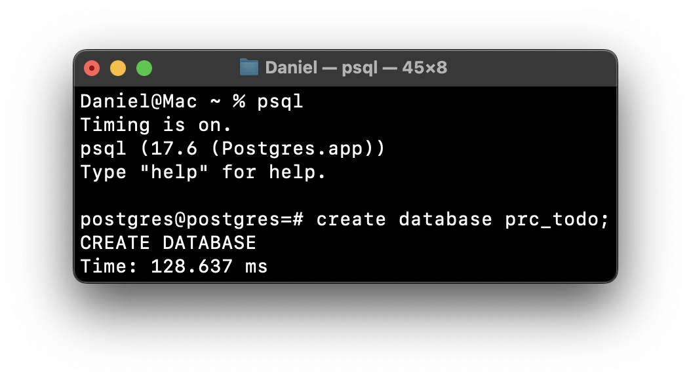
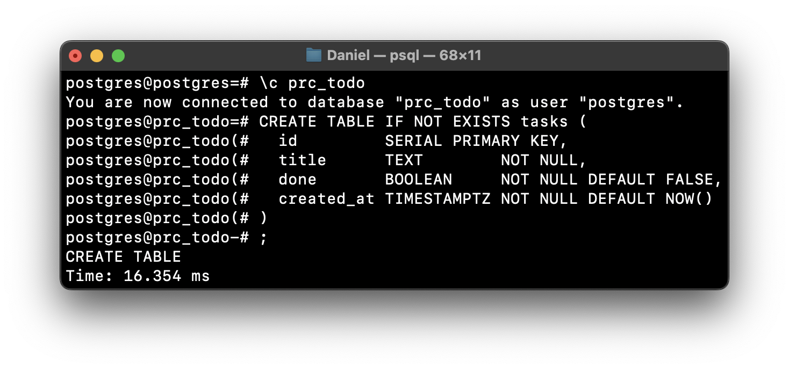
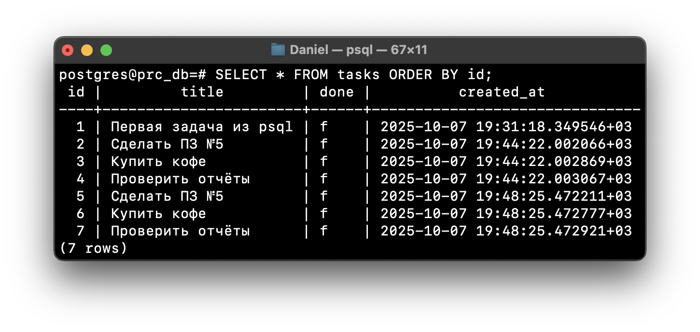
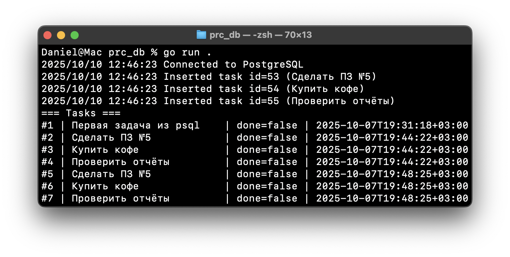

# Коляда Даниил

Команда создания датабазы `prc_todo`
```sql
create database prc_todo;
```


Команда создания таблицы `tasks`
```sql
create table if not exists tasks (
    id serial primary key,
    title text not null,
    done boolean not null default false,
    created_at timestamptz not null default now()
);
```


Команда вывода всех записей из таблицы `tasks`
```sql
select * from tasks order by id;
```


Вывод после исполнения
```
go run .
```


Реализована
[функция](./repo#L51-L68)
`ListDone`, возвращающая список задач по параметру `done`
```go
func (r *Repo) ListDone(ctx context.Context, done bool) ([]Task, error)
```

Реализована
[функция](./repo#L70-L88)
`FindByID`, возвращающая задачу по `id`
```go
func (r *Repo) FindByID(ctx context.Context, id int) (*Task, error)
```

Реализована
[функция](./repo#L90-L117)
`CreateMany`, производящая массовую вставку с параметрами `titles` и `dones` через транзакцию
```go
func (r *Repo) CreateMany(ctx context.Context, titles []string, dones []bool) error
```

---

### Ответы на вопросы
Пул соединений `*sql.DB` – это коллекция соединений с базой данных, которая управляет эффективным использованием ресурсов

`db.SetMaxOpenConns(10)` — устанавливает максимальное кол-во открытых соединений\
`db.SetMaxIdleConns(5)` — устанавливает максимальное кол-во неактивных соединений\
`db.SetConnMaxLifetime(30 * time.Minute)` — устанавливает время жизни соединения

---

Плейсхолдеры (`$1`, `$2` и т.д.) используются в SQL-запросах для безопасной передачи параметров

---

| Функция |Возвращаемое значение | Описание |
|-|-|-|
| **Query** | `*Rows`, `error` | Выполняет SQL-запрос и возвращает множество строк в виде `*Rows` |
| **QueryRow** | `*Row`, `error` | Выполняет SQL-запрос и возвращает только одну строку |
| **Exec** | `Result`, `error` | Выполняет SQL-запрос, который не возвращает строк (например, `INSERT`, `UPDATE`, или `DELETE`) |

---

Транзакции в базах данных обеспечивают атомарность, целостность, изолированность и постоянство (ACID) операций
