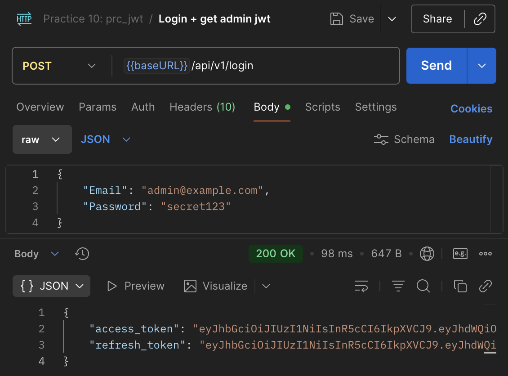
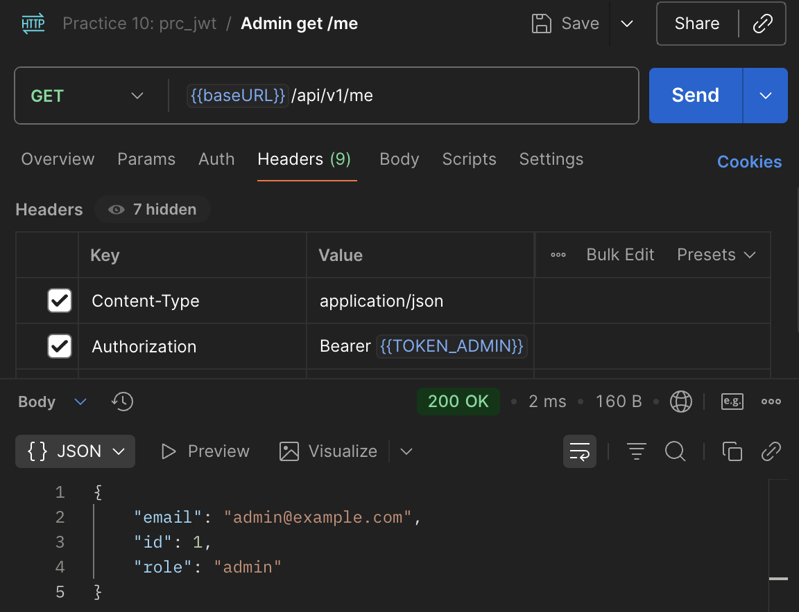
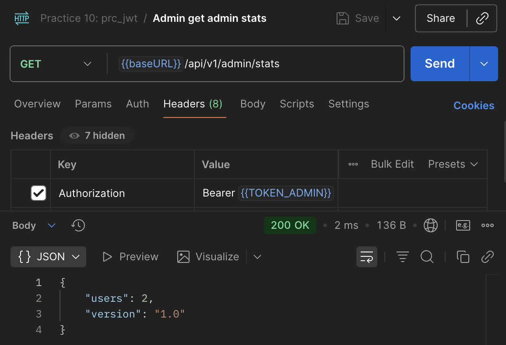
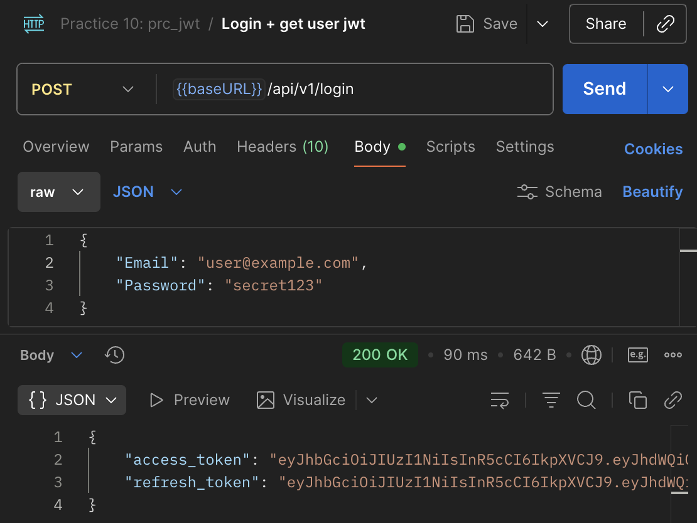
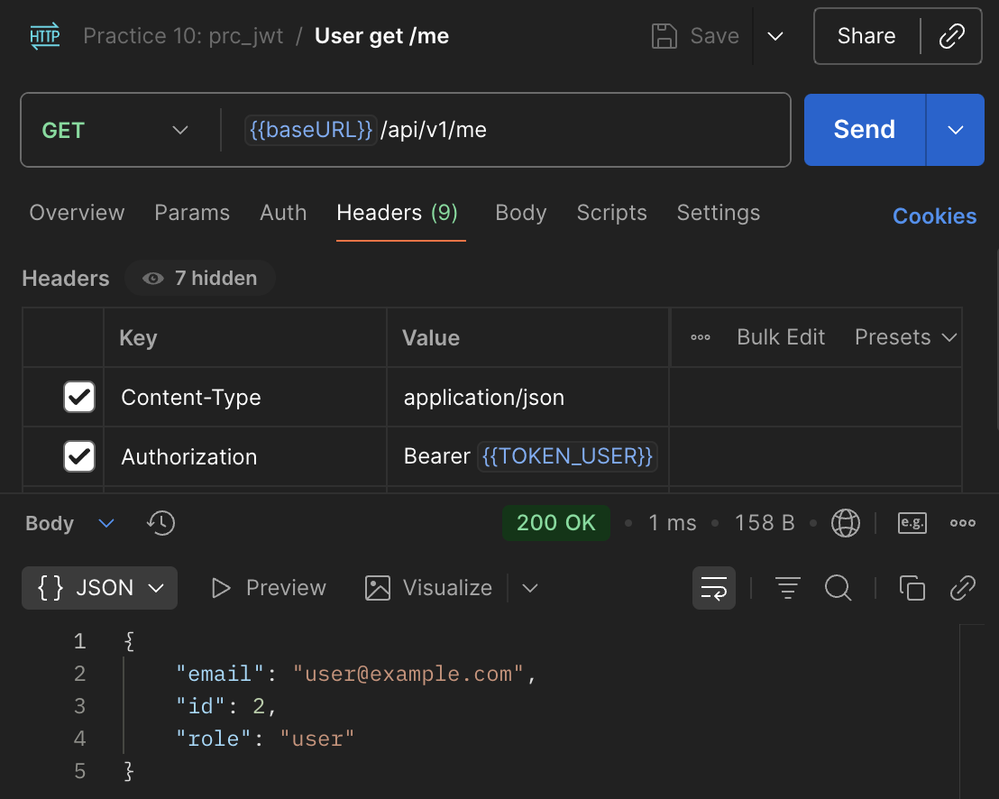
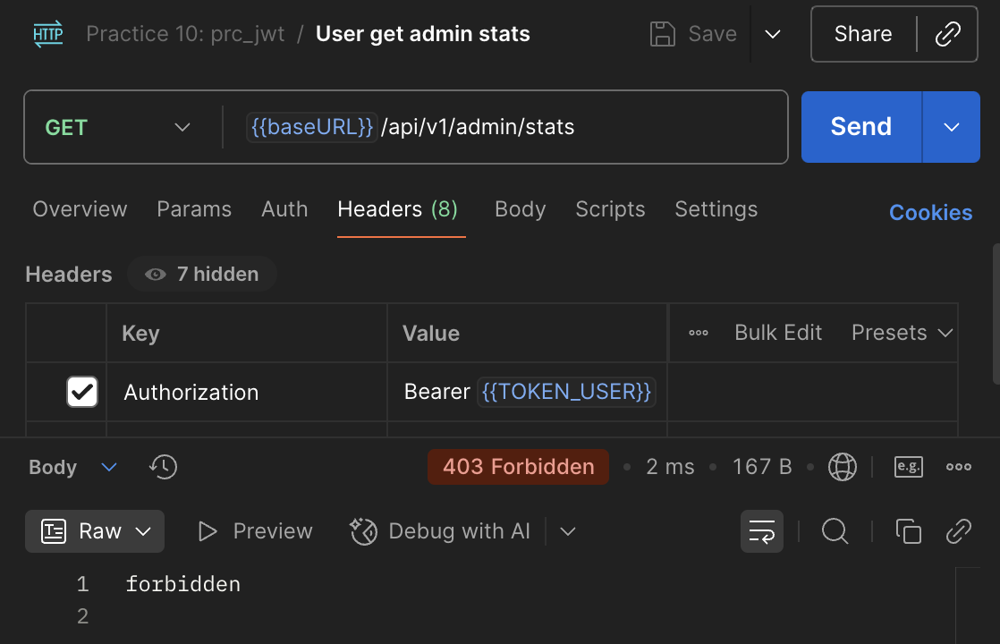
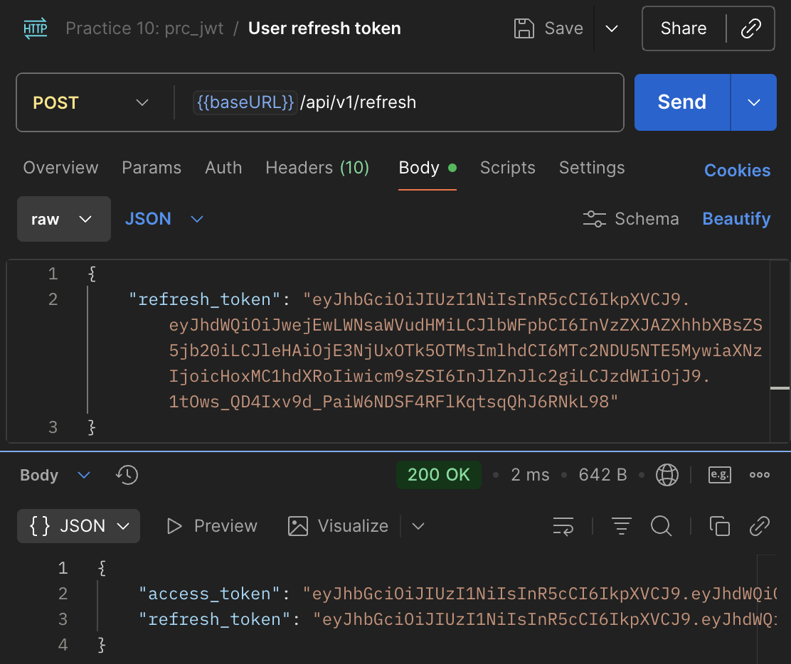
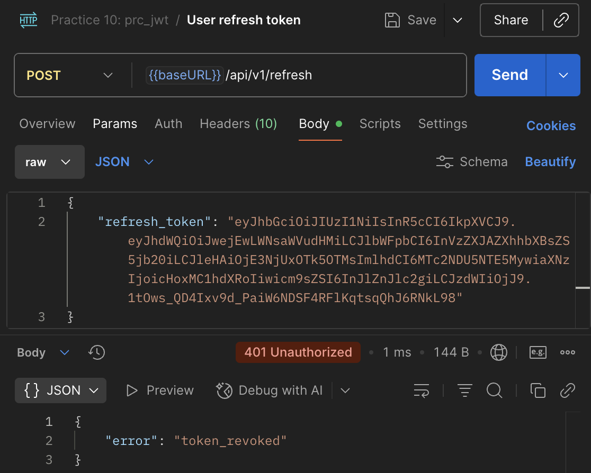
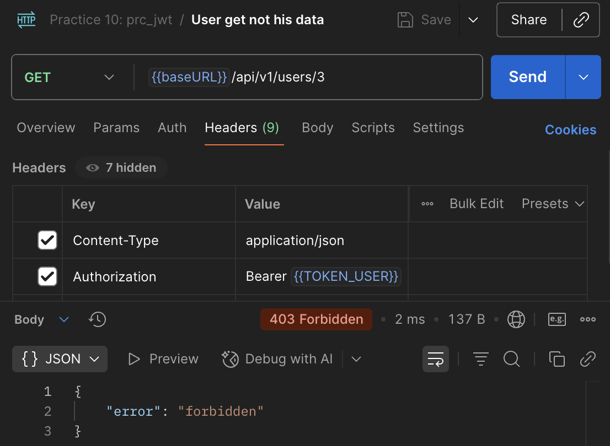
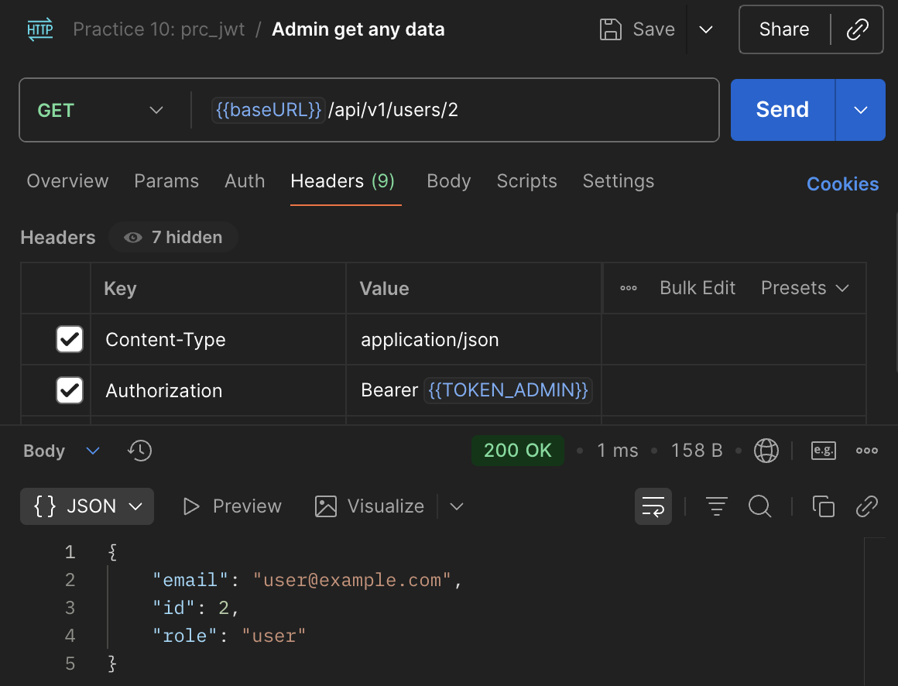

# Коляда Даниил
## Практическая работа №10

### Краткое описание

- Создали сервис аутентификации и авторизации по JWT токену
- Реализовали middleware-аутентификацию
- Добавили middleware-авторизацию (RBAC/права на эндпоинты)
- Реализовали refresh механику

---

Публичные маршруты
| Тип | Адрес | email | password |
|-|-|-|-|
| POST | my.domain/api/v1/login | admin@example.com | secret123 |
| POST | my.domain/api/v1/login | user@example.com | secret123 |
| POST | my.domain/api/v1/refresh |
| POST | my.domain/api/v1/logout |

---

Защищенные маршруты
| Тип | Адрес |
|-|-|
| GET | my.domain/api/v1/me |

---

Маршруты для админов
| Тип | Адрес |
|-|-|
| GET | my.domain/api/v1/admin/stats |

---

### Результаты тестирования

<details>
<summary>Результаты тестирования 👈🏻</summary>

<p align="center">
    <p>Авторизация как админ</p>
    
    <p>Получение информации о пользователе по токену</p>
    
    <p>Получение статистики по токену админа</p>
    
    <p>Авторизация как обычный пользователь</p>
    
    <p>Получение информации о пользователе по токену</p>
    
    <p>Попытка просмотра статистики обычным пользователем</p>
    
    <p>Обновление токена</p>
    
    <p>Попытка обновеления отозванного токена</p>
    
    <p>Попытка доступа к данным стороннего пользователя от лица обычного</p>
    
    <p>Попытка доступа к данным стороннего пользователя от лица админа</p>
    
</p>
</details>

---

### Настройка переменных окружения

Переименуйте файл `.env.example` в `.env`\
Задайте корректный `APP_PORT`, `JWT_SECRET` и `JWT_TTL`

---

### Дерево проекта
```
prc_jwt
├── .env.example
├── README.md
├── cmd
│   └── api
│       └── main.go
├── go.mod
├── go.sum
├── internal
│   ├── core
│   │   ├── blacklist.go
│   │   ├── service.go
│   │   └── user.go
│   ├── http
│   │   ├── middleware
│   │   │   ├── authn.go
│   │   │   └── authz.go
│   │   └── router.go
│   ├── platform
│   │   ├── config
│   │   │   └── config.go
│   │   └── jwt
│   │       └── jwt.go
│   └── repo
│       └── user_mem.go
└── screenshots
    ├── ...

13 directories, 24 files
```