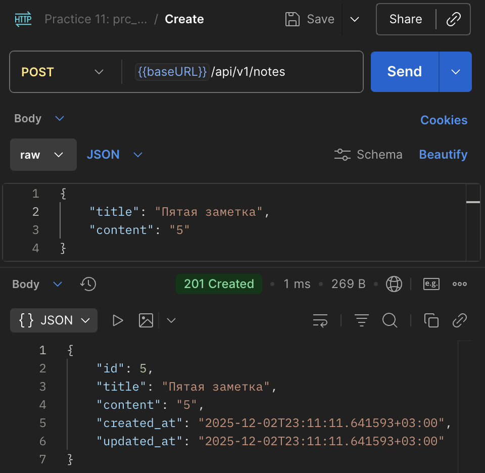
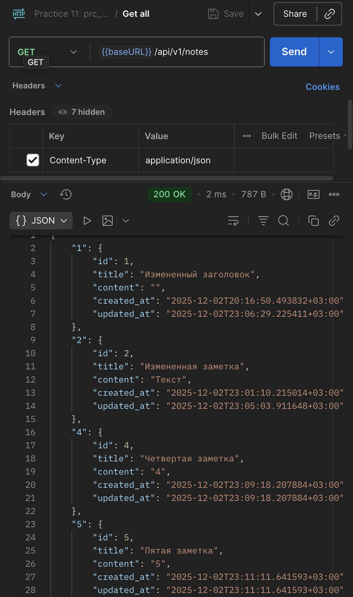
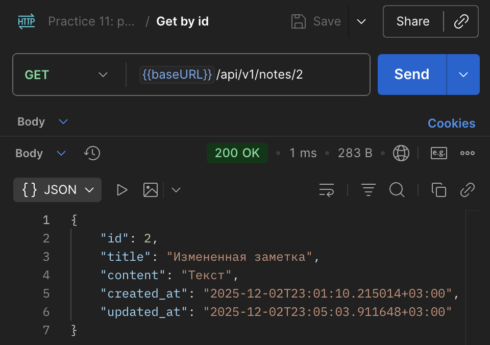
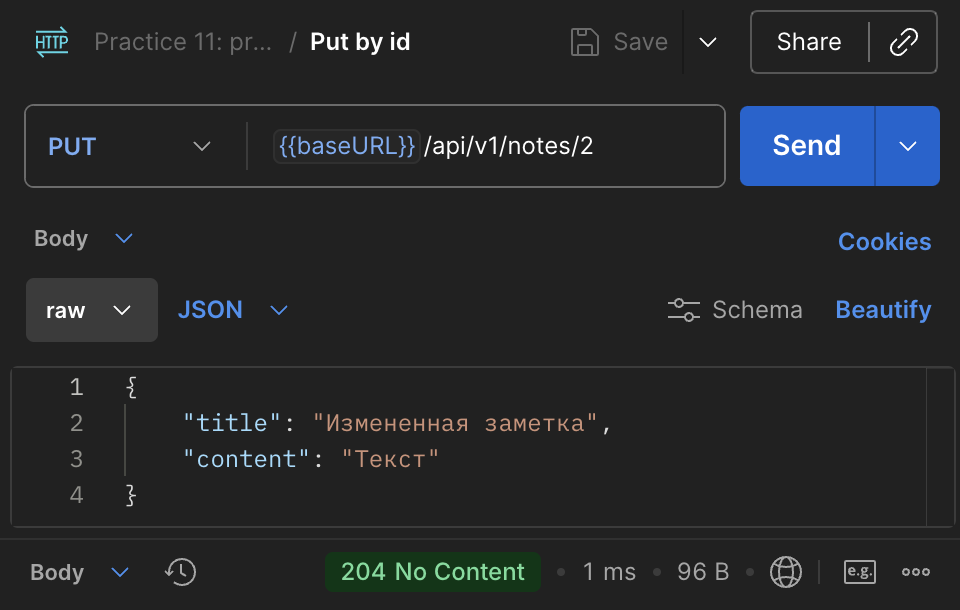
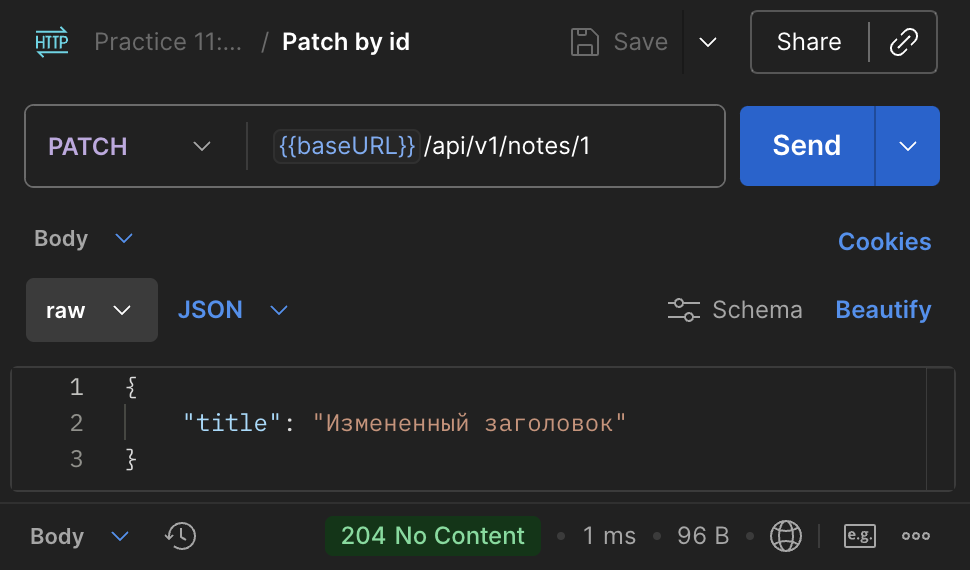
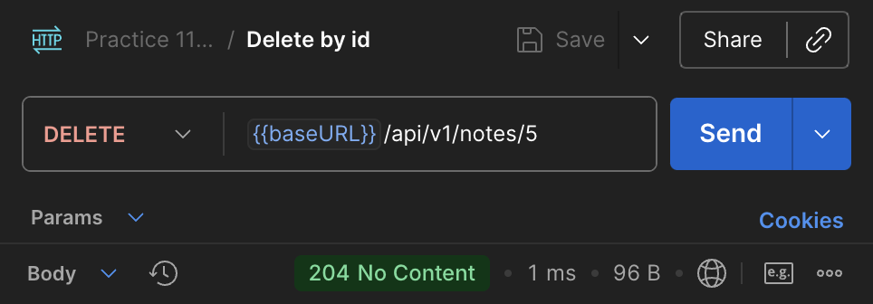

# Коляда Даниил
## Практическая работа №11

### Цели работы

1. Освоить принципы проектирования REST API
2. Научиться разрабатывать структуру проекта backend-приложения на Go
3. Спроектировать и реализовать CRUD-интерфейс (Create, Read, Update, Delete) для сущности «Заметка»
4. Освоить применение слоистой архитектуры (handler → service → repository)
5. Подготовить основу для интеграции с базой данных и JWT-аутентификацией в следующих занятиях

---

### Понятие REST API

REST (Representational State Transfer) — это архитектурный стиль взаимодействия клиентских и серверных приложений через протокол HTTP
Основные принципы:
- Ресурсность — всё в API представлено как ресурс (например, /notes)
- Стандартизированные методы HTTP:
    - GET — получение данных
    - POST — создание ресурса
    - PATCH/PUT — обновление
    - DELETE — удаление
- Без состояния (stateless) — каждый запрос содержит всю необходимую информацию
- Единообразие интерфейса — структура запросов и ответов одинакова для всех ресурсов

---

### Краткое описание

Реализовали CRUD-интерфейс (Create, Read, Update, Delete) для сущности «Заметка»\
Подготовили основу для интеграции с базой данных и JWT-аутентификацией в следующих занятиях

---

### Реализованные эндпоинты

| Тип | Адрес |
|-|-|
| POST | my.domain/api/v1/notes |
| GET | my.domain/api/v1/notes |
| GET | my.domain/api/v1/notes/{id} |
| PUT | my.domain/api/v1/notes/{id} |
| PATCH | my.domain/api/v1/notes/{id} |
| DELETE | my.domain/api/v1/notes/{id} |

---

### Результаты

|  |  |  |
|-|-|-|
|  |  |  |

---

### Выводы

Реализовали CRUD-интерфейс (Create, Read, Update, Delete) для сущности «Заметка»\
Подготовили основу для интеграции с базой данных и JWT-аутентификацией в следующих занятиях

---

### Дерево проекта
```
prc_notes_api
├── README.md
├── api
│   └── openapi.yaml
├── cmd
│   └── api
│       └── main.go
├── go.mod
├── go.sum
├── internal
│   ├── core
│   │   ├── note.go
│   │   └── service
│   │       └── note_service.go
│   ├── http
│   │   ├── handlers
│   │   │   └── notes.go
│   │   └── router.go
│   └── repo
│       └── note_mem.go
└── screenshots
    ├── ...

11 directories, 16 files
```
