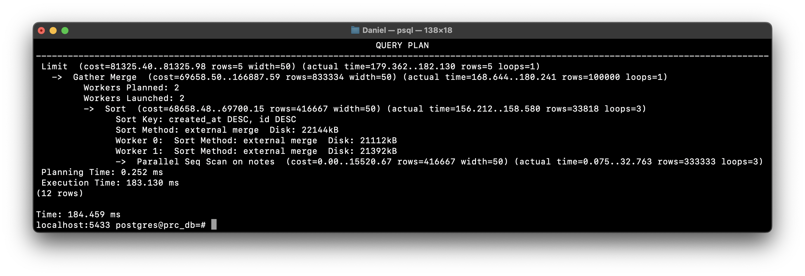
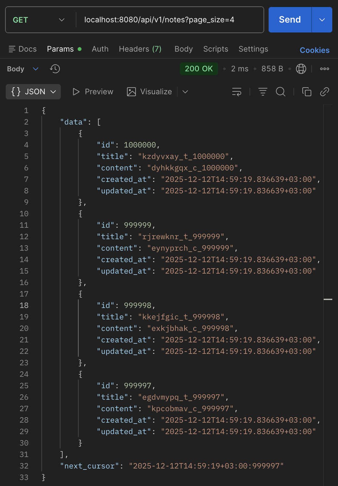
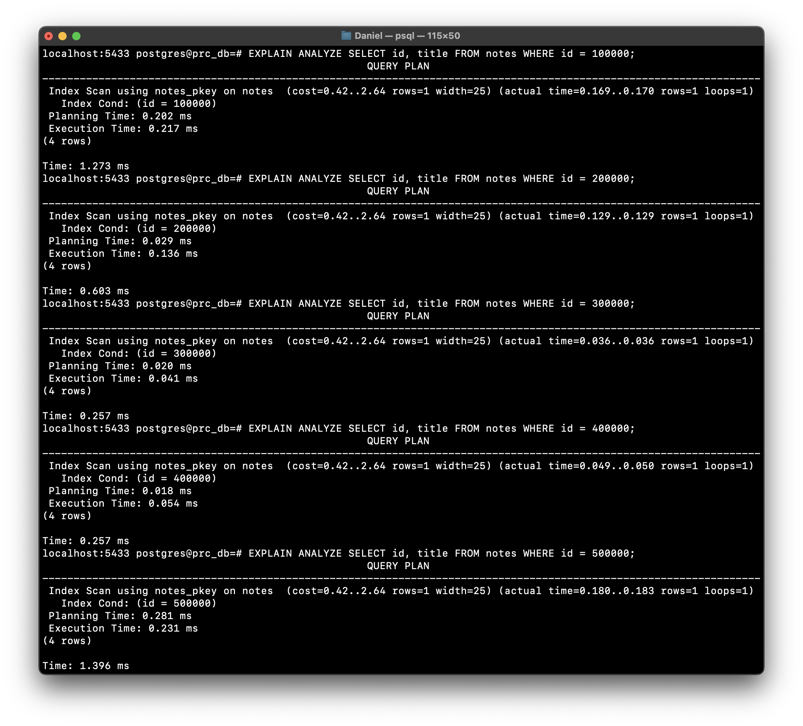
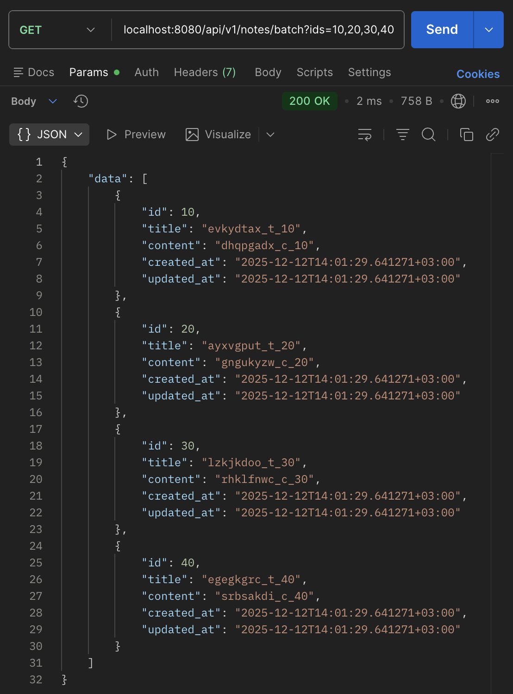
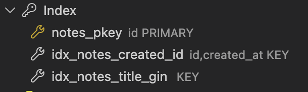
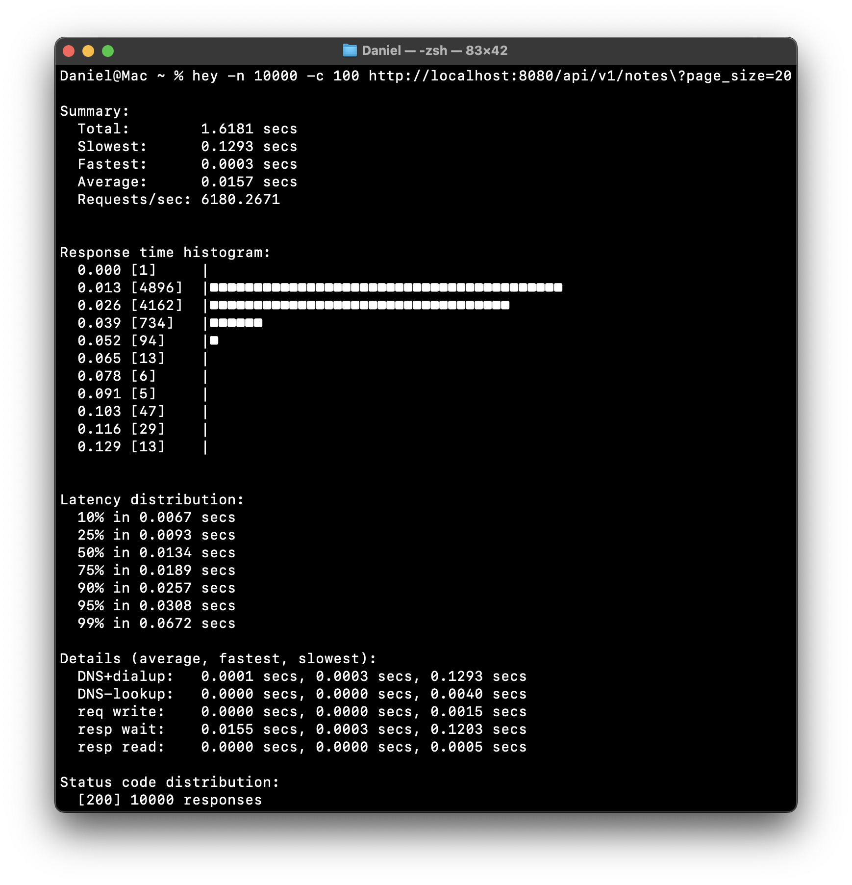

# Коляда Даниил
## Практическая работа №14

### Цели работы

1. Научиться находить «узкие места» в SQL-запросах и устранять их (индексы, переписывание запросов, пагинация, батчинг)
2. Освоить настройку пула подключений (connection pool) в Go и параметры его тюнинга
3. Научиться использовать EXPLAIN/ANALYZE, базовые метрики (pg_stat_statements), подготовленные запросы и транзакции
4. Применить техники уменьшения N+1 запросов и сокращения аллокаций на горячем пути

---

### Конфигурация пула
```go
MaxOpenConns:    20,
MaxIdleConns:    10,
ConnMaxLifetime: 30 * time.Minute,
ConnMaxIdleTime: 5 * time.Minute,
```

---

### Проблемные запросы и их планы

**Использование OFFSET**

Запрос использует пагинацию с применением OFFSET, что неэффективно при больших смещениях\
Этот запрос со временем замедляется по мере увеличения значения OFFSET

```sql
SELECT id, title, content, created_at
FROM notes
ORDER BY created_at DESC, id DESC
OFFSET $1 LIMIT $2;
```

План выполнения


Тестирование
```
curl localhost:8080/api/v1/notes\?page_size=4
```



---

**N+1 запросов**

Каждый запрос вызывает отдельное сканирование таблицы, что приводит к множественным обращениям к БД\
Это может привести к значительным накладным расходам

```sql
SELECT id, title FROM notes WHERE id = $1;
-- Повторяется N раз
```

План выполнения


Тестирование
```
curl localhost:8080/api/v1/notes/batch\?ids=10,20,30,40
```



---

### Индексы

Создали частичный индекс для поиска по заголовку, если часто ищем по prefix
```sql
CREATE INDEX IF NOT EXISTS idx_notes_title_gin
ON notes USING GIN (to_tsvector('simple', title));
```

Создали индекс для keyset-пагинации
```sql
CREATE INDEX IF NOT EXISTS idx_notes_created_id
ON notes (created_at, id);
```



---

### Нагрузочное тестирование

**Keyset-пагинация**

```bash
hey -n 10000 -c 100 http://localhost:8080/api/v1/notes\?page_size=20
```



---

**Батчинг**

```bash
hey -n 10000 -c 100 http://localhost:8080/api/v1/notes/batch\?ids=1,2,3,4
```


---

### Выводы

Научились находить «узкие места» в SQL-запросах и устранять их. Освоили настройку пула подключений (connection pool) в Go и параметры его тюнинга

Научились использовать EXPLAIN/ANALYZE, индексы, применять техники уменьшения N+1 запросов и использовать keyset пагинацию

---

### Дерево проекта
```
prc_optim_14
├── README.md
├── cmd
│   └── api
│       └── main.go
├── docs
│   ├── docs.go
│   ├── swagger.json
│   └── swagger.yaml
├── go.mod
├── go.sum
├── internal
│   ├── core
│   │   ├── note.go
│   │   └── types.go
│   ├── db
│   │   └── connection.go
│   ├── http
│   │   ├── handlers
│   │   │   └── notes.go
│   │   └── router.go
│   └── repo
│       ├── interface.go
│       ├── note_mem.go
│       └── note_postgres.go
└── screenshots
    ├── ...

11 directories, 22 files
```