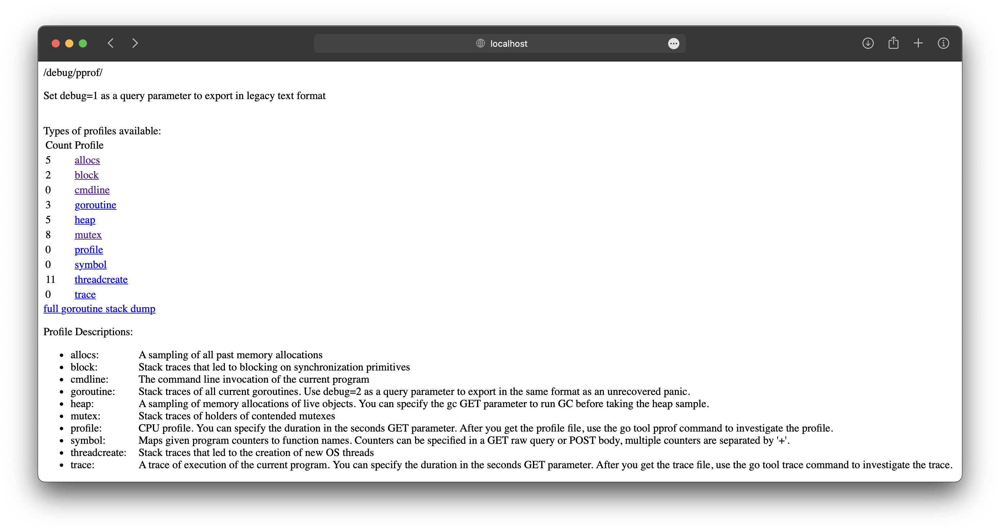
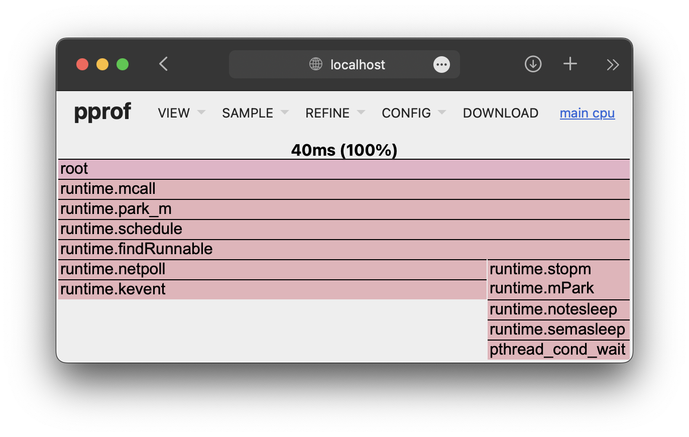
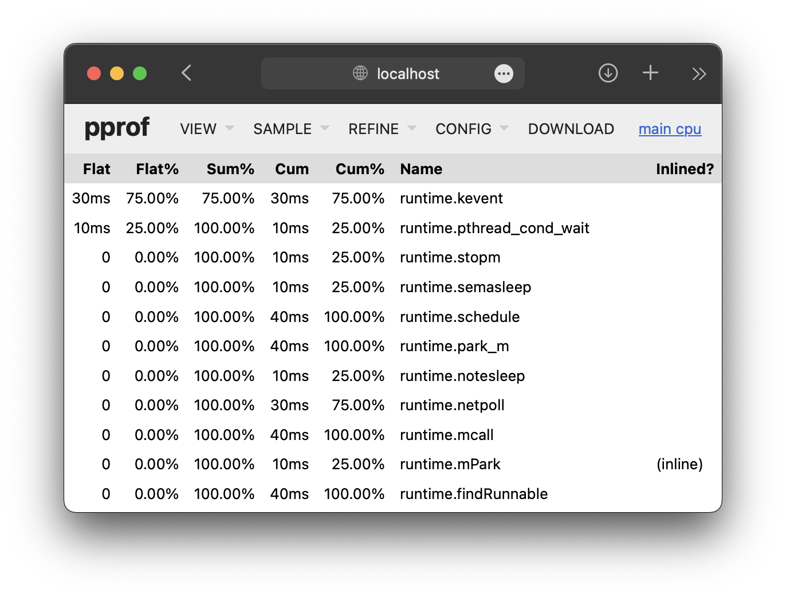
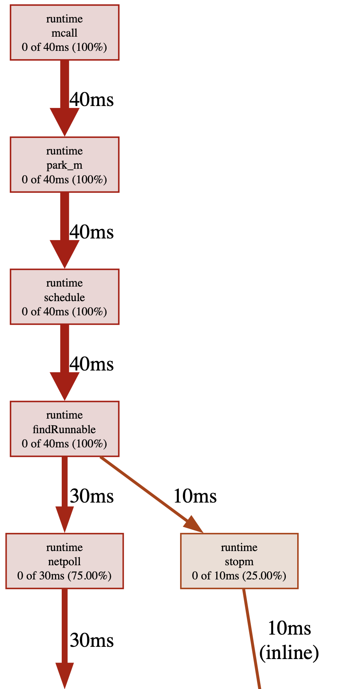
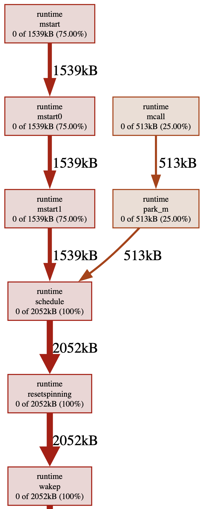
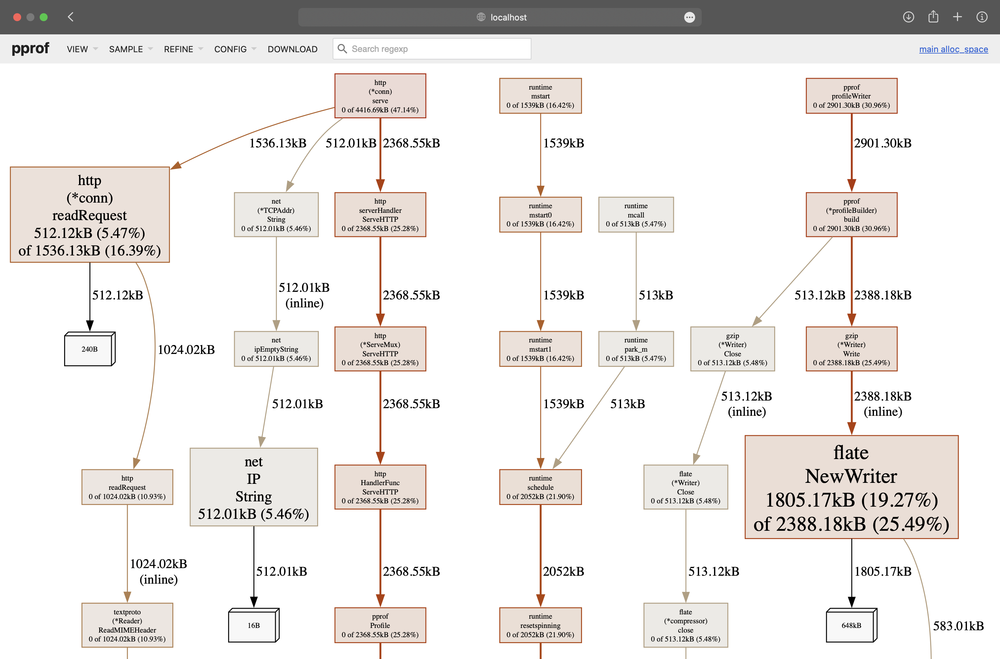
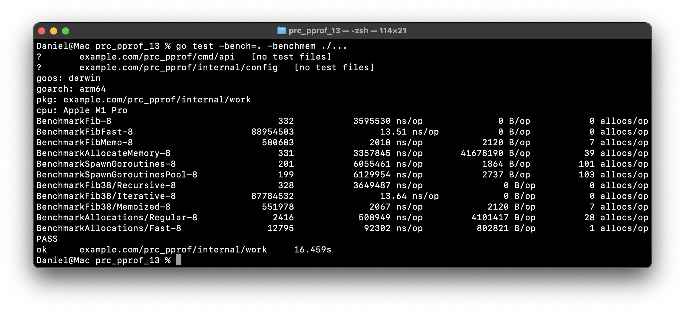

# Коляда Даниил
## Практическая работа №13

### Цели работы

1. Научиться подключать и использовать профилировщик pprof для анализа CPU, памяти, блокировок и горутин
2. Освоить базовые техники измерения времени выполнения функций (ручные таймеры, бенчмарки)
3. Научиться читать отчёты go tool pprof, строить графы вызовов и находить “узкие места”
4. Сформировать практические навыки оптимизации кода на основании метрик

---

### Нагрузка


---

### Web интерфейс



---

### Анализ профилей

CPU 30 сек:

Flame Graph


Top


Graph


Heap:

Inuse_space — сколько памяти удерживается


Alloc_space — сколько выделено суммарно


---

### Бенчмарк



---

### Выводы

Научились подключать и использовать профилировщик pprof для анализа CPU, памяти, блокировок и горутин. Освоили базовые техники измерения времени выполнения функций (ручные таймеры, бенчмарки)

Научились читать отчёты go tool pprof, строить графы вызовов и находить “узкие места”. Сформировали практические навыки оптимизации кода на основании метрик

---

### Дерево проекта
```
prc_pprof_13
├── README.md
├── cmd
│   └── api
│       └── main.go
├── go.mod
├── internal
│   ├── config
│   │   └── profile.go
│   └── work
│       ├── optimized.go
│       ├── slow.go
│       ├── slow_test.go
│       └── timer.go
└── screenshots
    ├── ...

7 directories, 16 files
```