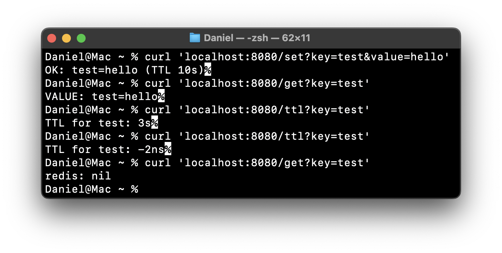

# Коляда Даниил
## Практическая работа №7

### Краткое описание
Redis (Remote Dictionary Server) — это высокопроизводительная in-memory система хранения данных, которая работает по принципу «ключ–значение»

---

Redis применяется там, где важна скорость и масштабируемость\
Типичные сценарии:
- Кэширование результатов запросов к базе данных (например, список товаров, популярные статьи, профили пользователей)
- Хранение сессий в веб-приложениях (замена cookie/базы)
- Очереди задач (Redis поддерживает списки и pub/sub-модель)
- Счётчики и рейтинги (например, количество лайков или просмотров)
- Геоданные и поиск (операции GEO*, фильтры по расстоянию)

---

TTL (Time-To-Live) — время жизни ключа
- Если TTL установлен, то ключ автоматически исчезает из Redis после указанного времени
- Это удобно для кэширования: данные живут в кэше ограниченное время и автоматически обновляются
- TTL помогает избежать устаревших данных и перегрузки памяти

---

> [!WARNING]
> ## Сервер не запущен
> ### Реализованные эндпоинты
> | Адрес | Описание |
> |-|-|
> | [my.domain:8080/set?key=test&value=hello](https://google.com) | Устанавливает ключ `test` и значение `hello` |
> | [my.domain:8080/get?key=test](https://google.com) | Получает значени по ключу `test` |
> | [my.domain:8080/ttl?key=test](https://google.com) | Получает время жизни ключа `test` |

---

### Выполнение запросов


---

### Дерево проекта
```
prc_redis
├── README.md
├── cmd
│   └── server
│       └── main.go
├── go.mod
├── go.sum
├── internal
│   └── cache
│       └── cache.go
└── screenshots
    └── Screenshot_1.png
```