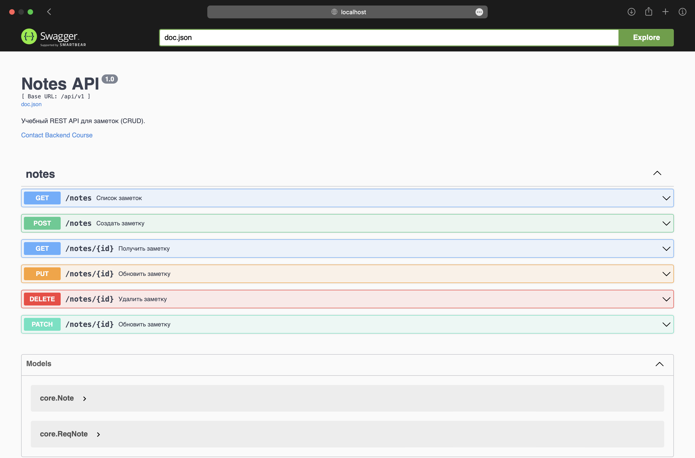

# Коляда Даниил
## Практическая работа №12

### Цели работы

1. Освоить основы спецификации OpenAPI (Swagger) для REST API
2. Подключить автогенерацию документации к проекту из ПЗ 11 (notes-api)
3. Научиться публиковать интерактивную документацию (Swagger UI / ReDoc) на эндпоинте GET /docs
4. Синхронизировать код и спецификацию (комментарии-аннотации → генерация) или «schema-first» (генерация кода из openapi.yaml)
5. Подготовить процесс обновления документации (Makefile/скрипт)

---

### Аннотации

Аннотация над методом `ListNotes`
```go
// ListNotes возвращает список всех заметок
// @Summary      Список заметок
// @Description  Возвращает список всех заметок
// @Tags         notes
// @Produce      json
// @Success      200    {array}  core.Note
// @Failure      500    {object}  map[string]string
// @Router       /notes [get]
func (h *Handler) ListNotes(w http.ResponseWriter, r *http.Request) {...}
```

Аннотация над методом `Create`
```go
// CreateNote создает новую заметку
// @Summary      Создать заметку
// @Description  Создает новую заметку с указанным заголовком и содержимым
// @Tags         notes
// @Accept       json
// @Produce      json
// @Param        input  body      core.ReqNote  true  "Данные новой заметки"
// @Success      201    {object}  core.Note
// @Failure      400    {object}  map[string]string
// @Failure      500    {object}  map[string]string
// @Router       /notes [post]
func (h *Handler) CreateNote(w http.ResponseWriter, r *http.Request) {...}
```

---

### Swagger UI



---

### Команды генерации документации

```bash
swag init -g cmd/api/main.go -o docs
```

Также был создан
[Makefile](./Makefile),
поэтому можно просто писать

```bash
make swagger
```

---

### Выводы

Освоили основы спецификации OpenAPI (Swagger) для REST API, подключили автогенерацию документации к проекту из ПЗ 11 (notes-api)

Научились публиковать интерактивную документацию на эндпоинте GET /docs.
Синхронизировали код и спецификацию, используя подход code-first, и создали Makefile

---

### Дерево проекта
```
prc_swagger_12
├── Makefile
├── README.md
├── cmd
│   └── api
│       └── main.go
├── docs
│   ├── docs.go
│   ├── swagger.json
│   └── swagger.yaml
├── go.mod
├── go.sum
├── internal
│   ├── core
│   │   └── note.go
│   ├── http
│   │   ├── handlers
│   │   │   └── notes.go
│   │   └── router.go
│   └── repo
│       └── note_mem.go
└── screenshots
    └── ...

10 directories, 13 files
```