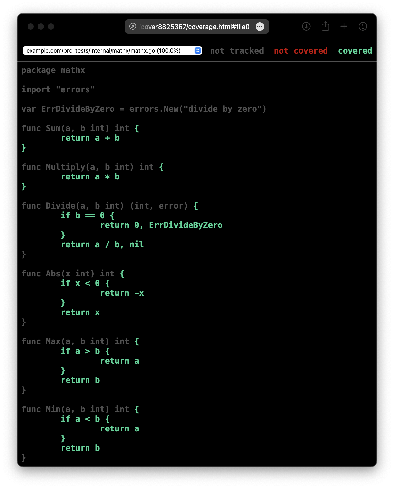
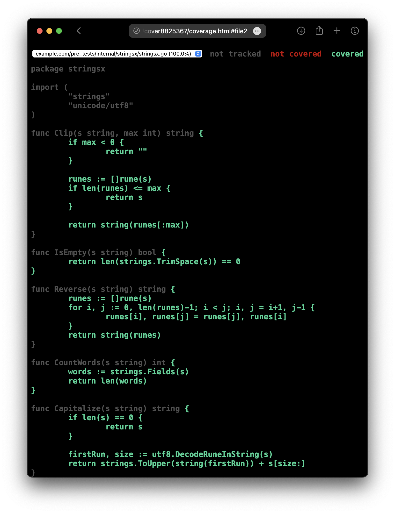
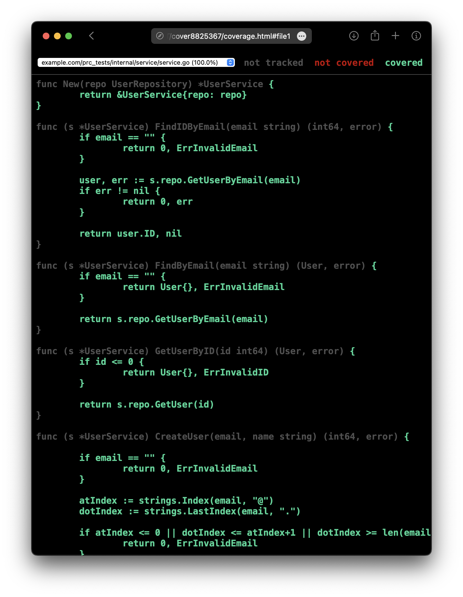

# Коляда Даниил
## Практическая работа №15

### Цели работы

1. Освоить базовые приёмы unit-тестирования в Go с помощью стандартного пакета testing
2. Научиться писать табличные тесты, подзадачи t.Run, тестировать ошибки и паники
3. Освоить библиотеку утверждений testify (assert, require) для лаконичных проверок
4. Научиться измерять покрытие кода (go test -cover) и формировать html-отчёт покрытия
5. Подготовить минимальную структуру проектных тестов и общий чек-лист качества тестов

---

### Результаты тестирования

**Запуск всех тестов**

Команда
```bash
go test ./...
```

Вывод
```bash
ok      example.com/prc_tests/internal/mathx    (cached)
ok      example.com/prc_tests/internal/service  (cached)
ok      example.com/prc_tests/internal/stringsx (cached)
```

---

**Процент покрытия**

Команда
```bash
go test -cover ./...
```

Вывод
```bash
ok      example.com/prc_tests/internal/mathx    (cached)        coverage: 100.0% of statements
ok      example.com/prc_tests/internal/service  (cached)        coverage: 100.0% of statements
ok      example.com/prc_tests/internal/stringsx (cached)        coverage: 100.0% of statements
```

---

**Бэнчмарк**

Команда
```bash
go test -bench . ./internal/mathx
```

Вывод
```bash
goos: darwin
goarch: arm64
pkg: example.com/prc_tests/internal/mathx
cpu: Apple M1 Pro
BenchmarkSum-8          1000000000               0.3111 ns/op
BenchmarkMultiply-8     1000000000               0.3119 ns/op
BenchmarkDivide-8       1000000000               0.3125 ns/op
BenchmarkAbs-8          1000000000               0.3112 ns/op
BenchmarkMax-8          1000000000               0.3118 ns/op
PASS
ok      example.com/prc_tests/internal/mathx    1.732s
```

---

### Результаты отчета

Пакет `mathx`


Пакет `stringsx`


Пакет `service`


---

### Выводы

Освоили базовые приёмы unit-тестирования в Go с помощью стандартного пакета testing. Научились писать табличные тесты, подзадачи t.Run, тестировать ошибки и паники

Освоили библиотеку утверждений testify (assert, require) для лаконичных проверок. Научились измерять покрытие кода (go test -cover) и формировать html-отчёт покрытия

Подготовили минимальную структуру проектных тестов и общий чек-лист качества тестов

---

### Дерево проекта
```
prc_tests_15
├── README.md
├── coverage.out
├── go.mod
├── go.sum
├── internal
│   ├── mathx
│   │   ├── mathx.go
│   │   └── mathx_test.go
│   ├── service
│   │   ├── repo.go
│   │   ├── service.go
│   │   └── service_test.go
│   └── stringsx
│       ├── stringsx.go
│       └── stringsx_test.go
└── screenshots
    ├── ...

6 directories, 14 files
```