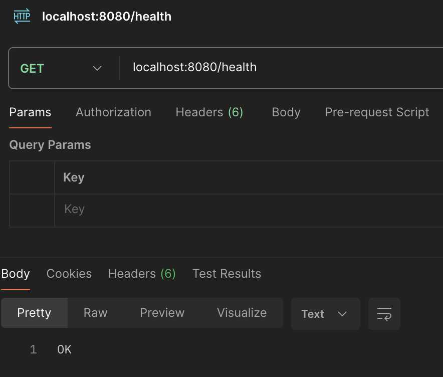
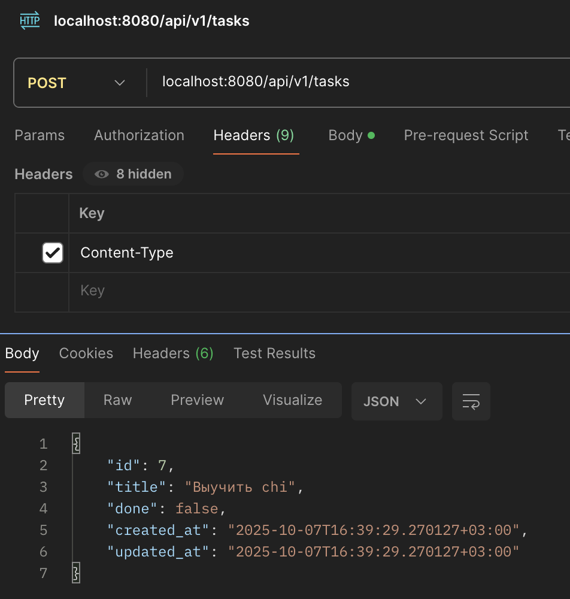
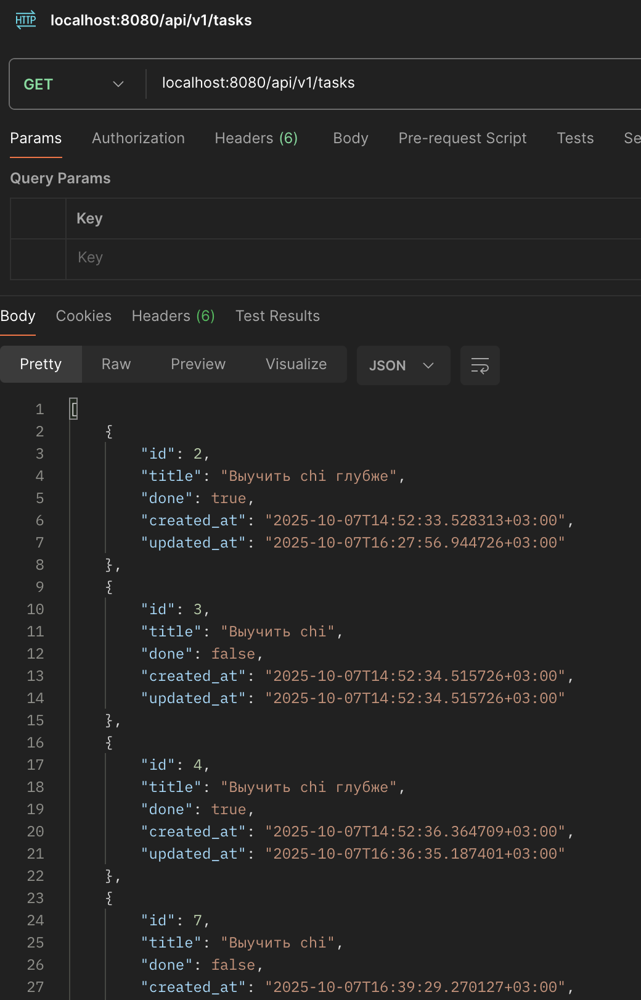
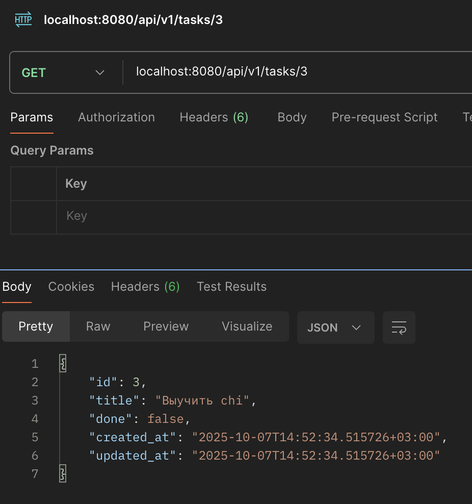
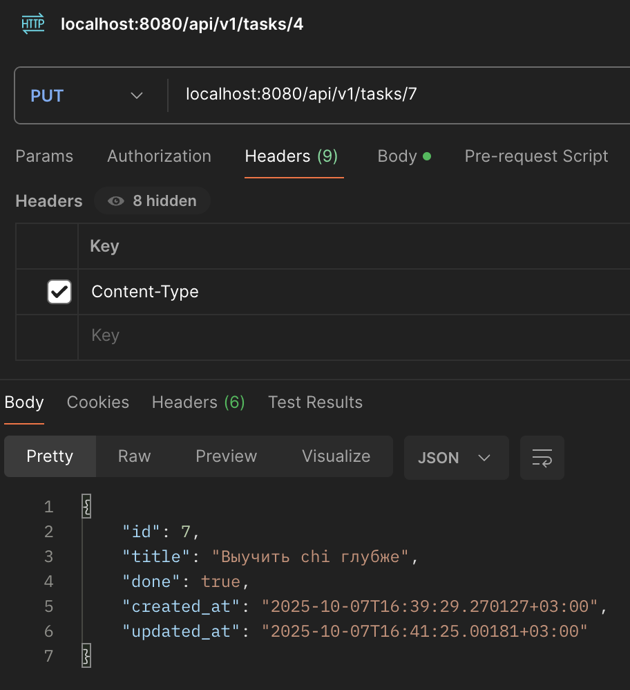
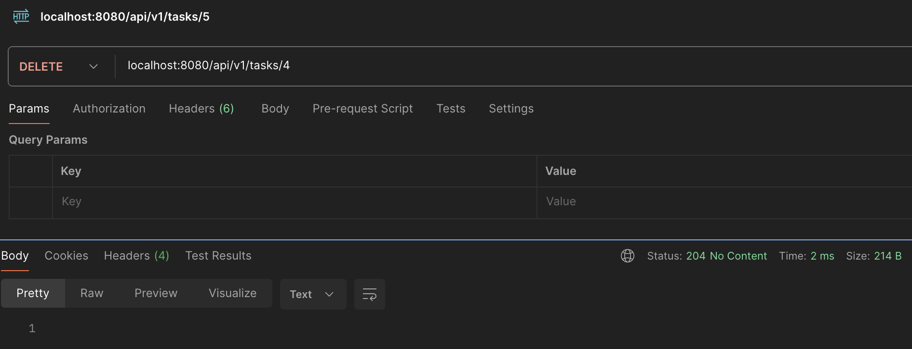
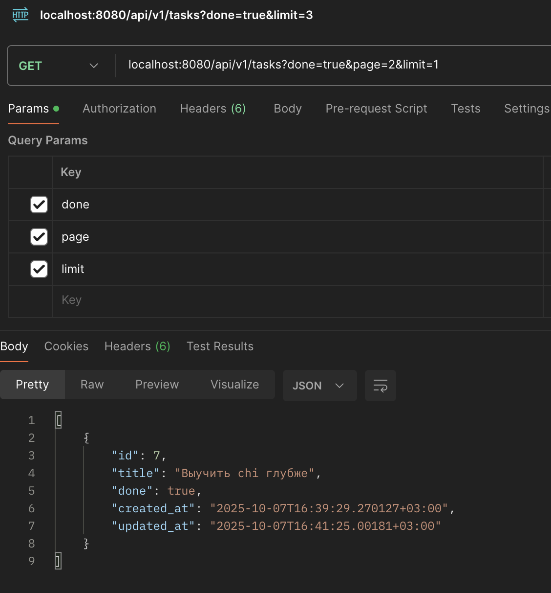

```
curl -i localhost:8080/health
```


```
curl -i -X POST localhost:8080/api/v1/tasks \
-H "Content-Type: application/json" \
-d '{"title":"Выучить chi"}'
```


```
curl -i localhost:8080/api/v1/tasks
```


```
curl -i localhost:8080/api/v1/tasks/3
```


```
curl -i -X PUT localhost:8080/api/v1/tasks/7 \
-H "Content-Type: application/json" \
-d '{"title":"Выучить chi глубже", "done":true}'
```


```
curl -i -X DELETE localhost:8080/api/v1/tasks/4
```


```
curl -i localhost:8080/api/v1/tasks?done=true&page=2&limit=1
```
